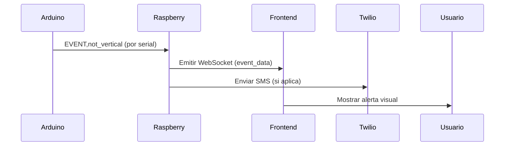

# 📡 Antenna Monitor — Real-time Fall Detection & Alert System

Esta aplicacion permite monitorear en tiempo real la inclinación de una antena utilizando un Arduino conectado a un sensor MPU6050. Si se detecta una caída (posición no vertical), se visualiza la alerta en una interfaz web 3D usando Three.js y se puede notificar por SMS usando Twilio.

---

## 📷 Screenshot


---

 


## 🛠️ Instalación en Raspberry Pi

1.	Clona el repositorio
    ```bash
    git clone https://github.com/tu_usuario/antenna-monitor.git
    cd antenna-monitor
    ```
2.	Ejecuta el setup automático
    ```bash
    chmod +x setup.sh
    ./setup.sh
    ```

## 🚀 Ejecución del servidor

Una vez configurado, puedes iniciar el servidor con:

```bash
chmod +x run.sh
./run.sh
```

Este script:
- Carga variables de entorno desde .env.
- Espera a que el Arduino esté conectado.
- Lanza el servidor Flask.
- Muestra la IP de acceso: http://0.0.0.0:9000


## 📦 Estructura del Proyecto

```plaintext
antenna-monitor/
├── app.py                ← Main Flask app
├── serial_reader.py      ← Serial data handler
├── notifier.py           ← Twilio SMS handler
├── templates/
│   └── index.html        ← Web UI
├── static/
│   ├── css/
│   ├── js/
│   └── assets/
├── setup.sh              ← Instalador interactivo
├── run.sh                ← Script de ejecución
├── .env.sample
└── README.md
```