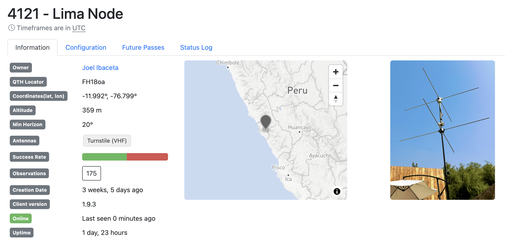
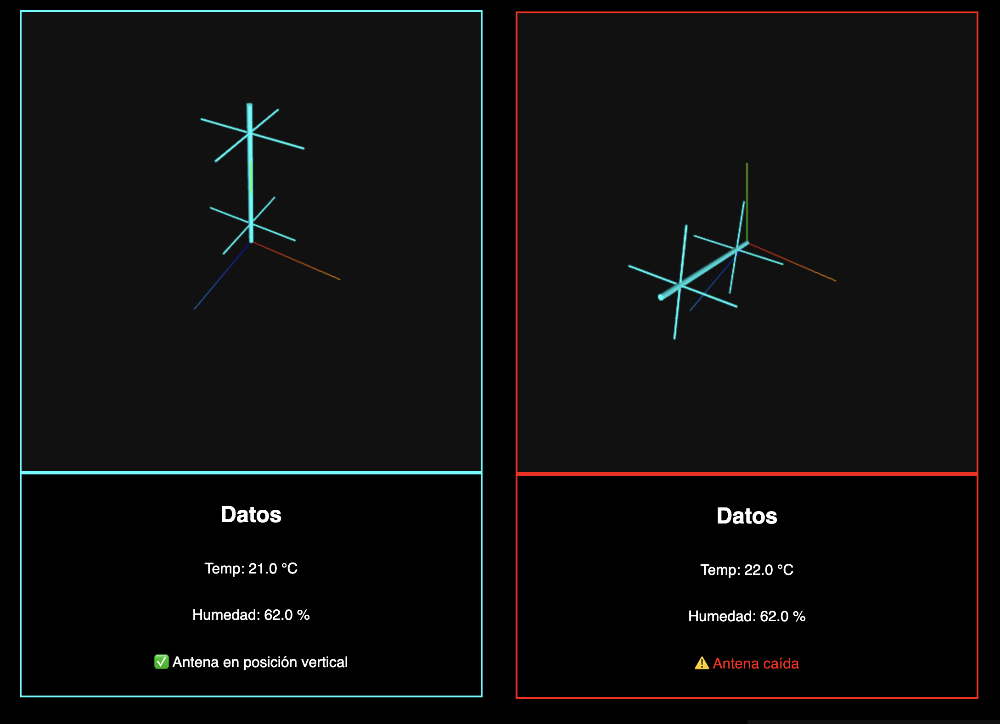

# Resilient Turnstile – Estación SatNOGS con Monitoreo Autónomo

Este repositorio tiene como finalidad proporcionar una implementación reproducible y documentada de una estación SatNOGS con capacidades de monitoreo estructural activo, basada en sensores embebidos. Se incluyen diagramas de conexión, archivos STL para componentes impresos en 3D, el código fuente modular para microcontroladores, scripts de integración con Raspberry Pi, así como evidencia del despliegue exitoso.

  

📺 **[Ver video de funcionamiento](https://youtu.be/yltyIin1x2w)**

---

El caso de estudio corresponde a la estación instalada en Lima, Perú (Nodo 4121), equipada con una antena turnstile construida artesanalmente y un sistema de monitoreo capaz de detectar impactos, caídas y sobrecalentamiento, generando eventos estructurados por puerto serial para su interpretación automática. Esta implementación ha demostrado una mejora tangible en la resiliencia operativa de la estación, al evitar la generación de observaciones inválidas durante eventos críticos.

El presente desarrollo se publica con el propósito de fomentar la replicación de estaciones SatNOGS similares en todo el Perú y Latinoamérica, atendiendo a la actual escasez de nodos operativos en la región. Esta baja densidad de estaciones limita tanto la cobertura de observaciones como la capacidad de contribuir de manera significativa a la ciencia abierta y a proyectos colaborativos globales de seguimiento satelital.

Mediante la difusión abierta de diseños, archivos STL, código fuente y documentación técnica, este repositorio busca proporcionar a entusiastas, investigadores y comunidades educativas una base probada y adaptable para implementar soluciones de bajo costo con alto impacto. 

Se espera que esta iniciativa contribuya al fortalecimiento de la red SatNOGS en América Latina, promoviendo una participación más activa, descentralizada y resiliente en la observación distribuida del espacio.

> Este proyecto surge como proyecto final del curso de Sistemas Embebidos de la Maestría en Inteligencia Artificial de la Universidad Nacional de Ingeniería (UNI). El reporte academico está disponible en docs/Report.pdf.

## 🛰️ ¿Qué incluye el proyecto?

- Antena turnstile construida a mano (137 MHz)
- Sensores: acelerómetro, impacto, temperatura y humedad
- Sistema basado en Arduino + Raspberry Pi, para simplificar su replicación
- Código abierto, modular y fácilmente replicable

## 📂 Estructura del repositorio

- `antenna/`: Cómo construir la antena (diagramas, materiales y STL)
- `arduino/`: Código fuente para Arduino (sensores y display)
- `raspberry/`: Script para procesar datos seriales y sitio web de monitoreo

## 🛠️ Cómo replicarlo

1. Construye la antena siguiendo [este instructivo](antenna/README.md)
3. Configura la Raspberry e instala el cliente SatNOGS siguiendo [esta guía](raspberry/README.md)
4. Sube tu nodo a SatNOGS y comienza a contribuir siguiendo [este tutorial](https://wiki.satnogs.org/Getting_Started)

**Si deseas incorporar el monitoreo estructural**

1. Sigue las instrucciones en [`arduino/README.md`](arduino/README.md) para construir el circuito e instalar los sensores.
2. Puedes usar el script para Arduino siguiendo las instrucciones en [`arduino/README.md`](arduino/README.md), sientente libre de modificarlo para adaptarlo a tus necesidades.
3. Si seguiste las instrucciones para la Raspberry Pi, el script de monitoreo ya estará instalado y ejecutándose. Puedes acceder al sitio web de monitoreo en `http://<IP_DE_TU_RASPBERRY>:8000`.

## 🛡️ Licencias

Este repositorio incluye componentes de software, hardware y documentación, cada uno licenciado de forma apropiada para fomentar su uso, modificación y redistribución:

- **Código fuente**: Licenciado bajo la [MIT License](LICENSE), lo que permite su uso libre, incluyendo fines comerciales, siempre que se mantenga la atribución.
- **Diseños de hardware**: Licenciados bajo [CERN Open Hardware License v2 - Strongly Reciprocal (CERN-OHL-S v2)](LICENSE-HARDWARE), garantizando que las modificaciones y mejoras permanezcan abiertas.
- **Documentación y recursos gráficos**: Licenciados bajo [Creative Commons Attribution-ShareAlike 4.0 International (CC BY-SA 4.0)](LICENSE-DOCS), permitiendo su uso y adaptación, siempre que se mantenga la atribución y se comparta bajo la misma licencia.
